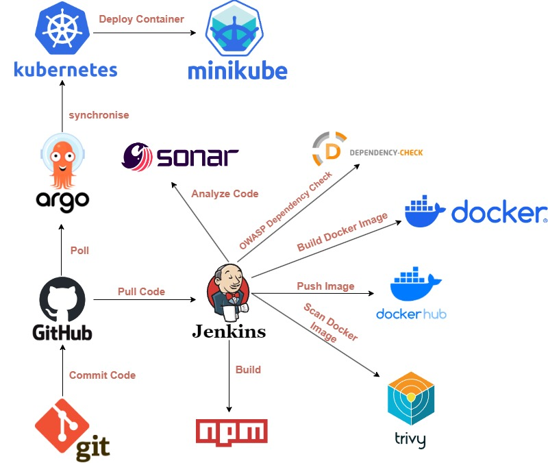
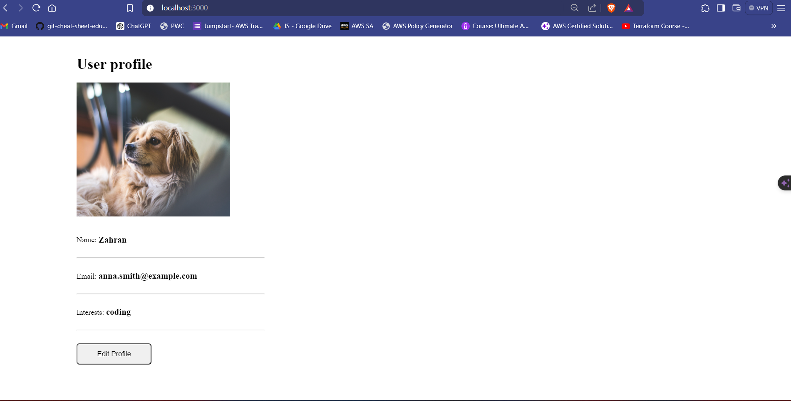

# Multi-Tier Web Application CI/CD Pipeline with Jenkins, Docker, Kubernetes, and ArgoCD

This repository contains an automated CI/CD pipeline for a Multi-Tier Web Application. The pipeline leverages Jenkins, Docker, Kubernetes, and ArgoCD to automate the build, test, security scan, and deployment process from code commit to production.

    

## Key Features:

### Jenkins Pipeline Automation:
- **SCM Polling:** Jenkins automatically polls the source code repository on GitHub for changes. This ensures that the pipeline runs automatically on every code commit.
- The pipeline includes stages for checking out the code, building the application, performing static code analysis, security scans, and deploying to a Kubernetes cluster managed by Minikube.
  

### Docker Integration:
- The application is packaged as a Docker image, ensuring consistency across development, testing, and production environments.
- The pipeline builds the Docker image, tags it with the build number, and pushes it to **Docker Hub**.

### Trivy Docker Image Scanning:
- **Trivy** is used to scan the Docker image for vulnerabilities, focusing on HIGH and CRITICAL severity issues before the image is pushed to Docker Hub.

### OWASP Dependency Check:
- The pipeline integrates **OWASP Dependency Check** to scan the application’s dependencies for known vulnerabilities.

  

### SonarQube Code Analysis:
- The pipeline integrates **SonarQube** for static code analysis, ensuring the code meets quality standards before deployment.
- SonarQube identifies potential bugs, code smells, and security vulnerabilities, with detailed reports available directly within Jenkins.

 

### Kubernetes Deployment:
- The Docker image is deployed to a **Kubernetes cluster** using **Minikube**.
- The pipeline includes steps to update Kubernetes manifests with the new Docker image tag, apply the configurations, and verify the deployment.

### MongoDB and Mongo Express Deployment:
- **MongoDB Deployment:** A Kubernetes Deployment is configured for MongoDB, including a Service to expose MongoDB to other services and a Secret to store MongoDB credentials securely.
- **Mongo Express Deployment:** A Kubernetes Deployment is set up for Mongo Express, which provides a web-based interface for MongoDB. A Service exposes Mongo Express within the cluster, and it uses the MongoDB credentials stored in the Kubernetes Secret.

### ArgoCD Continuous Deployment:
- **ArgoCD** is used for continuous deployment and synchronization of the Kubernetes manifests with the live cluster.
- ArgoCD automatically syncs the Kubernetes state in Minikube with the latest changes from the GitHub repository.
  

### Environment Setup and Verification:
- The pipeline starts with verifying the environment setup, including Docker and Minikube, to ensure that all necessary tools are in place.
- Minikube is automatically started if it's not already running, and the pipeline proceeds with the deployment.

## How It Works:

1. **SCM Polling:** Jenkins polls the source code repository for changes.
2. **Environment Setup:** Jenkins verifies the installation of required tools like Docker, Trivy, and Minikube.
3. **Build:** The Node.js application is built using `npm install`.
4. **SonarQube Analysis:** The source code is analyzed for quality and security using SonarQube.
5. **OWASP Dependency Check:** The application dependencies are scanned for known vulnerabilities.
6. **Docker Image Creation:** The application is packaged into a Docker image, tagged with the build number.
7. **Trivy Docker Image Scanning:** The Docker image is scanned for vulnerabilities using Trivy.
8. **Push Docker Image:** The Docker image is pushed to Docker Hub.
9. **Kubernetes Manifests Update:** The Kubernetes manifests are updated with the new Docker image tag.
10. **Kubernetes Deployment:** The updated manifests are applied to the Minikube cluster.
11. **ArgoCD Synchronization:** ArgoCD syncs the Kubernetes cluster with the latest manifest changes.
12. **Deployment Verification:** The pipeline verifies that the application is successfully deployed and running.

## Technologies Used:

- **Jenkins:** Automates the CI/CD pipeline.
- **Docker:** Containerizes the application for consistency across environments.
- **Kubernetes:** Manages the deployment of containerized applications.
- **ArgoCD:** Synchronizes the Kubernetes manifests with the live cluster.
- **Node.js:** Backend framework used to build the application.
- **SonarQube:** Ensures code quality through static code analysis.
- **Trivy:** Scans Docker images for security vulnerabilities.
- **OWASP Dependency Check:** Scans application dependencies for known vulnerabilities.

## How to Run Locally Using Minikube And ArgoCD:

1. **Prerequisites:** `ArgoCD and Minikube installed on your computer`
2. **Clone the Repository:** `git clone https://github.com/yourusername/your-repo.git`
3. **Start the Application:** Run `ArgoCD.yaml File`.
4. **Access the Application:** Open your browser and go to `http://localhost:3000`.

## How to Deploy Using Jenkins:

1. **Set Up Jenkins:** Ensure Jenkins is configured with the necessary plugins and tools.
2. **Create a Jenkins Job:** Use the provided `Jenkinsfile` to set up the pipeline.
3. **Run the Pipeline:** Start the pipeline to automate the build, test, and deployment process.

## Environment Variables:

- **SONARQUBE_TOKEN:** Token for authenticating with SonarQube.
- **NVD_KEY:** API key for OWASP Dependency Check.
- **DOCKERHUB_USERNAME:** DockerHub username for pushing images.
- **DOCKERHUB_PASSWORD:** DockerHub password for pushing images.
- **GIT_USERNAME:** GitHub username for pushing updates to manifests.
- **GIT_TOKEN:** GitHub token for authentication.
- **ARGOCD_URL:** URL for ArgoCD server.
- **ARGOCD_USERNAME:** ArgoCD username for authentication.
- **ARGOCD_PASSWORD:** ArgoCD password for authentication.

## Contributing:

Feel free to submit issues or pull requests if you find bugs or want to improve the project. Contributions are always welcome!
